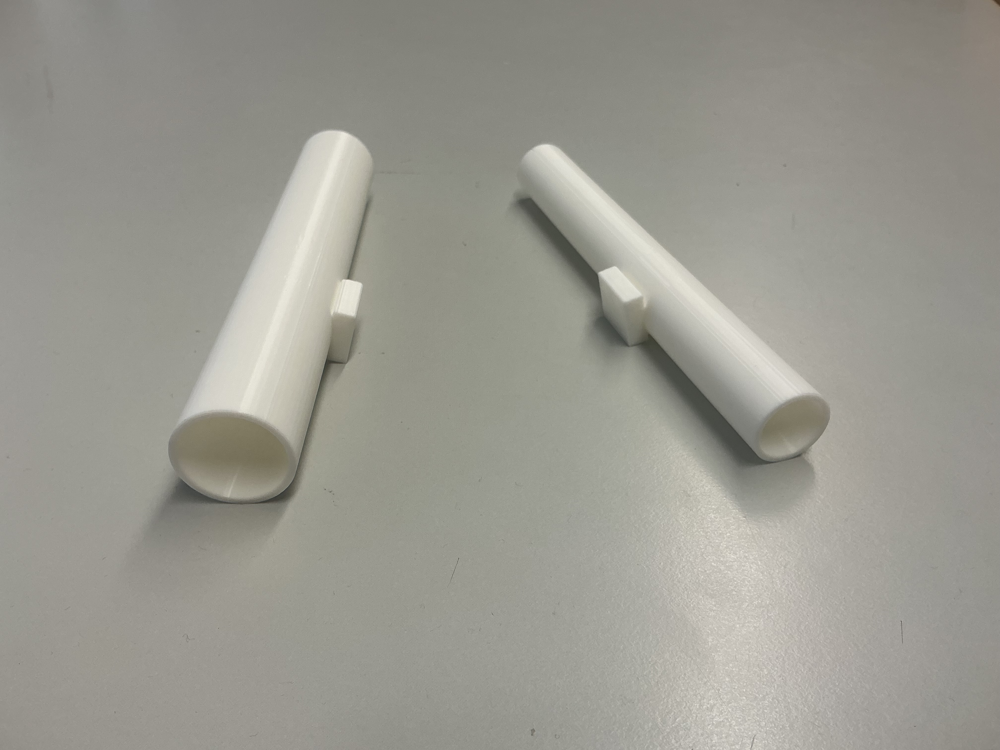

# **Inhaltsverzeichnis**
- [Vorwort](#vorwort)
- [Projekttag Nr.1 (18.08.2026)](#projekttag-nr1-18082026)
- [Projekttag Nr.2 (24.08.2026)](#projekttag-nr2-24082026)
- [Projekttag Nr.3 (25.08.2026)](#projekttag-nr-3-25082026)
- [Projekttag Nr.4 (31.08.2026)](#projekttag-nr-4-31082026)
- [Projekttag Nr.5 (01.09.2026)](#projekttag-nr-5-01092026)
- [Projekttag Nr.6 (07.09.2026)](#projekttag-nr-6-07092026)
- [Projekttag Nr.7 (08.09.2026)](#projekttag-nr-7-08092026)
- [Projekttag Nr.8 (14.09.2026)](#projekttag-nr-8-14092026)
- [Projekttag Nr.9 (15.09.2026)](#projekttag-nr-9-15092026)
- [Projekttag Nr.10 (21.09.2026)](#projekttag-nr-10-21092026)
- [Projekttag Nr.11 (22.09.2026)](#projekttag-nr-11-22092026)

# *Vorwort*
Zum Beginn der Projektfindung war uns beiden klar, dass wir nichts kleingemuetiges anfangen, daher haben wir uns fuer etwas revolutionaeres entschieden und zwar fuer den Holzblockvernichter 3000. Dieser ist nicht nur zur Eliminierung von Holzbloecken zustaendig, sondern bringt auch die Erleuchtung fuer Gottesfuerchtige, daher ist es fuer jedes freie Wesen nicht nur empfehlenswert dies zu unterstuetzen, sondern eine hoehere Aufgabe, alle Geluesste diesem unterzuordnen.

# *Projekttag Nr.1* (18.08.2026)
Heute ist beginn der Entwicklung unseres Meisterwerkes. Hierzu haben wir uns zwei Skizzen angefertigt und diese miteinander verglichen.
Der Gedanke ist mit horizontalen und vertikalen Servos, zwei Ultraschallsensoren schwenken zu lassen und damit ein funktionstüchtiges Radar zu erschaffen.
Mit den Daten aus diesem Radar soll dann für eine automatisierte Abschussvorrichtung mit manueller Nachladefunktion die Neigungs- und Schwenkposition errechnet werden. Diese ist ebenfalls auf einem horizontalen und vertikalen Servo.

# *Projekttag Nr.2* (24.08.2026)
Zum heutigen Tage haben wir uns mit Github beschaeftigt und dieses Readme.md als Repository angelegt.

# *Projekttag Nr. 3* (25.08.2026)
Am heutigen Tag haben wir uns genauere Gedanken zu dem Design der Abschussvorrichtung gemacht. Dabei mussten wir nach Simplifizierung und Kosten entscheiden. Dafür machten wir verschiedene Skizzen und haben diese zu einer neuen, höheren und besseren Perfektion geformt. Dabei haben wir uns an einem Design für [Blaster mit Federdruck](https://www.blasterparts.com/de/blog/grundlagen-blaster-mit-federdruck) orientiert und dieses angepasst an unsere Beduerfnisse.
Hier ist unsere angepasste Skizze, sowohl als auch die Skizze zur kompletten Abschussvorrichtung.

Ebenfalls haben wir eine Einkaufsliste für die Abschussvorrichtung des "Holzblockvernichter 3000" erstellt, mit dieser koennen wir in den naechsten Schritt der Planung gehen, die Revolution fortzufuehren.

# *Projekttag Nr. 4* (31.08.2026) 
Dieser Tag diente uns zur Ausarbeitung der Blogeintraege. Wir befassten uns hauptsaechlich mit "Projekttag Nr. 3", indem wir die Skizzen hinzufuegten, um Ihnen einen besseren Einblick in unsere Revolution zu geben. Ebenfalls haben wir uns ueber die ungefaehren groeßen des "Holzblockvernichter 3000" ausgetauscht, bei dieser besprechung haben wir uns auf eine groeße von ungefaehr 20cm vorraussichtlicht geeinigt.

# *Projekttag Nr. 5* (01.09.2026) 
An diesen produktiven Tage haben wir zum Beginn die Skizzen fuer das Radar fertiggestellt. Diese basiert auf dem gleichen Prinzip wie das Abschussrohr. Das Radar ist vor dem Rohr auf dem Stativ befestigt. Dazu haben wir uns entschieden, da wir nur ein Radius von ca. 180° scannen moechten.  Nachdem wir dies fertiggestellt haben, haben wir die [Liste](https://github.com/leolenny-187/Einkaufsliste) der benoetigten Materialien fortgefuehrt, da wir nun wussten was wir alles benoetigen wuerden. Dabei haben wir uns schonmal erste Gedanken ueber die Befestigung des Arduino Boards und Breadboards gemacht und uns vorlaeufig fuer die unterseite des Stativs festgelegt. Ebenfalls muessen wir nun die Revolutions benoetigten Materialien besorgen, da nicht bei jedem Produkt die Maße angegeben sind und wir diese fuer ein vervollstaendigtes 3D-Modell fuer den Drucker benoetigen.

# *Projekttag Nr. 6* (07.09.2026)
Am heutigen Tage haben wir uns dazu entschlossen eine Einverständnisserklärung zu formulieren, da unser Investor nur dieses Projekt unter dieser Vorraussetzung finanzieren wird. Ebenfalls haben wir ueber das bereits vorhandensein von Arduino Bestandteilen gesprochen und dies mit unseren Berater abgeklaert.

# *Projekttag Nr. 7* (08.09.2026)
Heute haben wir zum Beginn die einzelnen Arduino Bestandteile ausgemessen.  Darauf folgend haben wir begonnen ein 3D-Modell anzufertigen und einen ersten Code formuliert, dies ist [hier](https://www.tinkercad.com/things/gdRvWcBRKTj-holzblockvernichter-3000-v1?sharecode=1ndje9fyzaTf3L40UFoTnsgVxjvQgDXcrG7BvRgeALE) zu finden, mit diesen Informationen koennen wir in der naehesten Zeit das Modell fertig stellen und den 3D-Drucker in Betrieb nehmen. Nach dieser Fertigstellung werden wir das Programm fertigstellen und den "Holzblockvernichter 3000" zusammenbauen um der Revolution einen Schritt naeher zu kommen.

# *Projekttag Nr. 8* (14.09.2026)
Den heutigen Tag nutzen wir um unseren Berater das Formular fuer die Einerstaendniss zu ueberreichen und die 3D Modelierung leicht zu ueberarbeiten, da der 3D-Drucker ab heute in Betrieb genommen werden kann. Ebenfalls fuegten wir Projekttag Nr. 7 & 5 die hinzugehoerigen Skizzen hinzu, um ihnen einen besseren Einblick in unsere hervorschreitenden Revolution zu ermoeglichen.

# *Projekttag Nr. 9* (15.09.2026)
Diesen Produktionsreichen Tag nutzten wir um unser Abschussrohr als Perfektion in der 3D-Modulation zu erschaffen. Dies taten wir indem wir drei Gruppierungen in Tinkercad erstellten, und zwar als erste das Federohr, welches vorne geoeffnet ist um die Feder und den Zugbolzen einzufuehren und hinten eine leichte Oeffnung fuer den Zugbolzen hat. Danach erstellten wir den Kugellauf, dieser hat eine Gewindeverbindung mit dem Federohr und eine verstärkte Wand, die ebenfalls am Anfang eine leichte Verengung hat, damit die Kugel nicht in das Federohr faellt. Zum Schluss erschufen wir den Zugbolzen. Dieser besteht aus einer langen Stange, einer Platte die die Feder beruehrt und einem getrennten Haltering, den wir am Ende dran kleben muessen, da wir sonst den Bolzen nicht einfuehren koennten. Dieses Modell ist [hier](https://www.tinkercad.com/things/lJU5ykN7JWS-komplette-schussvorrichtung-einzelteile?sharecode=8-KXtbsZajJZa0pd8wPVAeVksDtYPtpRggcoAMCdiMM) zu finden, damit sie ebenfalls in Betracht ziehen koennen, die Revolution voran zu treiben. **Ebenfalls muessen wir in naechster Zeit das Gegengewinde fuer den Lauf modellieren.**

# *Projekttag Nr. 10* (21.09.2026)
Heute haben wir unsere zwei Prototypen vom Abschussrohr erhalten und kontrolliert. Bei dieser Kontrolle ist uns aufgefallen, dass die Maße unserer 3D Modelle falsch sind, da wir davon ausgengangen sind, dass Prototyp 2 die richtigen Maße hat. Leider Gottes war aber Prototyp 1 richtig. Dadurch muessen wir die gesamte Dicke unserer Rohre, auf unserem vortgeschrittenen Modell, um 25% verringern. Dies werden wir in der naechsten Stunde fertigstellen, um unsere Revolution den vollstaendigen Glanz zu verleihen.

# *Projekttag Nr. 11* (22.09.2026) 
Zum Beginn des Tages haben wir die Maße der Abschussvorrichtung unseres Holzblockvernichters 3000 ueberarbeitet, um dies voll funktionstuechtig zu erstellen und dies in Praxis umsetzen zu koennen, haben wir ebenfalls das Gegengewinde und die Einkerbung bei dem Zugstab modelliert. Das Gegengewinde war zuerst herausfordernder da wir vergaßen, dass das Gewinde schon eine Bohrung von uns hatte. Gluecklicherweise ist dies uns nach kurzer Zeit aufgefallen, wodurch es schnell fertig gestellt war (dies ist [hier](https://www.tinkercad.com/things/cDZkSPqxXay-komplette-schussvorrichtung-einzelteile-v2?sharecode=8VwH5AVx3NlorV8hIyGUXy017OueMhJS0svMMXbjKbc) zu finden). Mit diesen Errungenschaften laesst sich die Revolution fortfuehren und bald in Praxis umsetzen.
